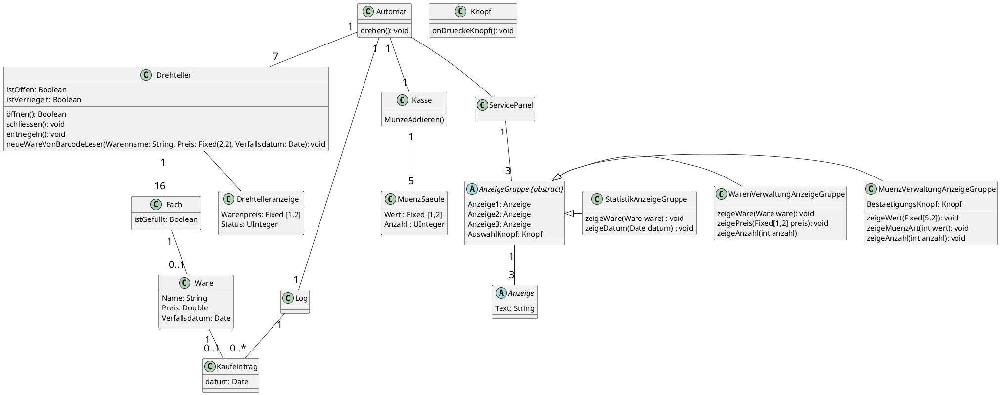
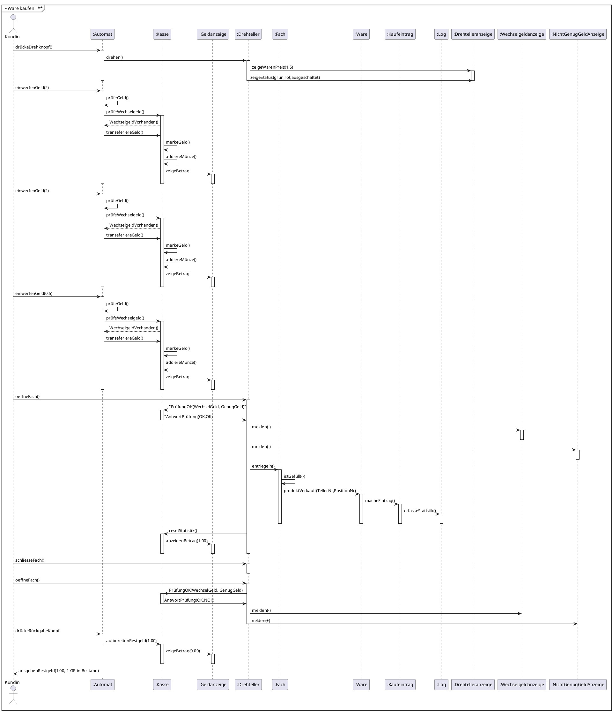

# Projektarbeit Objektorientierte Softwareentwicklung

## Aufgabe 1: Entwicklung von Use Cases

Akteure:
- Kunde
- Service-Personal

### a) Entwerfen Sie ein Use Case Diagramm

### b) Spezifizieren Sie die Details des Use Cases „Ware kaufen“

| | |
|---|---|
|**Use Case Name**          | Ware kaufen
|**Auslösender Aktor**      | Kunde
|**Zweck / Ziel**           | Kunde wählt gewünschte Ware und kann sie mit Münzen kaufen.
|**Eingehende Information** | geöffnetes Fach, Münzeinwurf
|**Ergebnis**               | Der Kunde kann die Ware aus dem Fach entnehmen. Der Automat gibt korrektes Rückgeld.
|**Grundlegender Ablauf**   |
|                           | 1. Kunde drückt auf Drehknopf.
|                           | 2. Automat dreht alle  Drehteller einen Schritt nach rechts.
|                           | 3. Automat zeigt Warenpreis und -status (grün,rot,weiss) für das vorderste Fach auf jedem Drehteller.
|                           | 4. Kunde wirft Münzen ein.
|                           | 5. Automat prüft Münzwährung und Münzsäulenbestand und Münzwert
|                           | 6. Automat zählt Münzarten, merkt sich diese und addiert den Gesamtbetrag und aktualisiert Münzenbestand
|                           | 7. Kunde versucht eine Schiebetür zu öffnen
|                           | 8. Automat prüft Status (Ware abgelaufen, nicht erhältlich, erhältlich)
|                           | 9. Automat prüft korrekten Betrag
|                           | 10. Automat prüft ob Wechselgeld vorhanden
|                           | 11. Automat entriegelt Schiebetür
|                           | 12. Kunde öffnet Tür und entnimmt Ware
|                           | 13. Automat aktualisiert Statuszeige
|                           | 14. Automat aktualisiert interne Statistik (Ware)
|                           | 15. Automat aktualisiert Anzeige Geldbetrag
|                           | 16. Kunde schliesst Schiebetür
|                           | 17. Automat verriegelt Schiebetür
|                           | 18. Kunde drückt Geldrückgabeknopf
|                           | 19. Automat gibt Rückgeld aus falls geschuldet und aktualisiert Münzenbestand
|                           | 20. Automat aktualisiert Anzeige Geldbetrag
|                           | 21. Kunde entnimmt Rückgeld
|**Erweiterungen**          | -
|**Alternativen**           | 5a [Münzsäule voll] Eingeworfene Münze wird wieder ausgegeben.
|                           | 9a [nicht genug Geld eingeworfen] Anezige "nicht genug Geld" wird angezeigt. Schiebetür bleibt geschlossen.
|                           | 10a [kein Wechselgeld vorhanden] Anzeige "kein Wechselgeld" wird angezeigt. Schiebetür bleibt geschlossen.
|                           | 16a [Kunde schliesst Schiebetür nicht] Drehteller können nicht gedreht werden.
|                           | 18a [Kunde wählt eine weitere Ware] Zurück zu 1.

---

## Aufgabe 2: Statisches und dynamisches Modell

### 4.2.2 Objektdiagramm

### 4.2.3 Squenzdiagramme

#### a) Waren kaufen

#### b) Warenwert des Automaten berechnen

